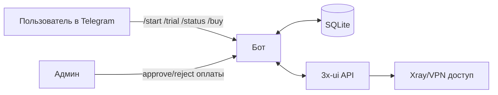

# RKN Bot Telegram

Телеграм-бот для выдачи и управления VPN-подписками через 3x-ui.

## Для чего нужен

- Автоматически выдает триал новому пользователю.
- Хранит состояние подписки и платежей в SQLite.
- Позволяет пользователю смотреть статус и повторно получать ссылку подписки.
- Упрощает ручную модерацию оплат и продление доступа.

## Как работает (по этапам)

1. Пользователь запускает бота и регистрируется через `/start`.
2. Получает триал через `/trial`, бот создает клиента в 3x-ui и сохраняет данные в БД.
3. Проверяет состояние подписки через `/status` и при необходимости получает ссылку через `/link`.
4. Оформляет оплату через `/buy`, бот создает заявку и переводит пользователя в ожидание подтверждения.
5. Админ подтверждает/отклоняет платеж, после подтверждения бот продлевает доступ и обновляет лимиты в 3x-ui.
6. Фоновый планировщик отслеживает сроки триалов, отправляет предупреждения и отключает просроченные доступы.

## Мини-схема

## Текущий статус

Сейчас реализован базовый каркас проекта и конфигурация через `.env` с валидацией обязательных переменных.
